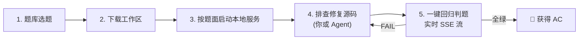

<div align="center">

# 💩 屎山 Hot 100 (ShiShan Hot 100)

**AI 时代的「力扣 100 题」· 真实后端代码回归评测平台与 OnCall 模拟器**

[](https://nextjs.org/)
[](https://react.dev/)
[](https://spring.io/projects/spring-boot)
[](https://openjdk.org/)
[](LICENSE)

[English](./README_EN.md) · **简体中文** · [题目列表](#-题目清单与段位) · [快速上手](#-快速上手) · [设计哲学](#-为什么要做屎山-hot-100)

<br/>

</div>

> **“十年前，程序员在白板上反转二叉树；**  
> **今天，大模型 1 秒写出快排，却在并发死锁、脏缓存回填、编码破坏的屎山里反复破防。”**

---

## 💡 为什么要做「屎山 Hot 100」？

在传统算法刷题时代，我们用 **LeetCode Hot 100** 训练纯算法思维；  
但在大模型时代，生成独立算法函数早已不是门槛，**真正的工程痛点变成了：**

- 真实的线上故障从来不会附带输入输出边界提示；
- 业务代码盘根错节：锁顺序交叉、缓存与 DB 双写时序、字符编码隐式截断、多租户精度混乱；
- 面对数万行的工程，各类 Coding Agent（Cursor、Claude Code、Trae、Gemini、Copilot 等）和工程师能否具备真正的 **排障定位能力（RCA / Root Cause Analysis）**？

**ShiShan Hot 100 就是为此而生的实战靶场与评测基准。**  
每道题都是一个**能跑但有毒**的完整工业级后端工程（Spring Boot）。把它下发到本地，不管是你亲自上手还是交给 AI Agent，修完后一键回归测试：**探活心跳 → 契约校验 → 多步流程 → 混合并发压测 → 日志扫描，全绿即 AC！**

---

## ✨ 核心特性

- 🏭 **真实工业级场景，杜绝玩具代码**：包含真实 Web 上下游、数据库/缓存模拟、并发业务场景，代码没有送分注释，逼真还原线上事故。
- 🎯 **LeetCode 极简交互体验**：自适应标签折叠筛选、做题进度统计、状态指示器（通过/已下载/未开始），界面极简清爽。
- ⚙️ **硬核本地回归评测引擎（Runner）**：
  - **心跳预检**：毫秒级网络与服务状态探活；
  - **单接口断言**：精准匹配 HTTP 状态码、JSON 结构体与耗时；
  - **多步 Workflow**：跨请求变量提取（`extract`）与动态插值验证业务链路；
  - **混合并发压测（Load Test）**：自定义并发度、轮次与权重混合请求，硬断言 P95 延时与成功率，揪出瞬时并发死锁；
  - **日志断言（Log Test）**：自动抓取新增日志，断言无告警特征与无回填痕迹。
- 🛡️ **严格反泄题体系**：
  - 题面采用**真实线上工单体**，严禁技术差分诊断与剧透；
  - 按测试点解锁：通过的点立即展示名称、说明和详细日志，未通过的点继续隐藏；
  - L1~L3 渐进式线索折叠，代码中零剧透注释。
- 🏆 **Codeforces 经典 10 段位体系**：从 `Newbie`、`Pupil`、`Specialist`、`Expert` 一路升级到 `Candidate Master`（紫名）乃至 `Legendary Grandmaster`（彩虹）。
- 🔒 **数据不出本地，零 Token 消耗**：题目从本地仓库下发，服务在你本机运行，判题全在本地回环网络执行，绝不泄露你的代码，不花一分钱外部 API 积分！

---

## 📚 题目清单与段位

| 编号 | 题目名称 | 难度段位 | 核心技术标签 | 线上工单现象（真实反馈） |
| :---: | :--- | :---: | :--- | :--- |
| **01** | [SHISHAN001 · 请求缓慢问题](problems/SHISHAN001) | <span style="color:#6f6b63">Newbie (灰)</span> | `Java` `多线程` `线程同步` | 平时好好的，活动一开大量下单失败报 504 系统繁忙；但低峰期单人测试完全正常。 |
| **02** | [SHISHAN002 · 共享钱包的两副面孔](problems/SHISHAN002) | <span style="color:#2c5a86">Expert (蓝)</span> | `Java` `数据一致性` `读写时序` | 两个游戏共用中台钱包，一个看有一千块另一个看只有一块；充值提示到账但退出重进又变回原值。 |
| **03** | [SHISHAN003 · 失真的文件仓库](problems/SHISHAN003) | <span style="color:#67457f">Candidate Master (紫)</span> | `Java` `文件处理` `哈希` | 文件上传成功但按哈希指纹查不到；图片附件下载到本地全部报文件损坏无法打开。 |
| **04** | [SHISHAN004 · 时空错位的文件服务](problems/SHISHAN004) | <span style="color:#3d6b4a">Pupil (绿)</span> | `Java` `文件处理` | 文件上传接口返回成功和访问地址，但紧接着获取附件却返回 404。 |
| **05** | [SHISHAN005 · 消息接收重复问题](problems/SHISHAN005) | <span style="color:#d83b01">Grandmaster (红)</span> | `Java` `多线程` `生产者消费者模型` | 客户端消息偶发重复显示 2~3 次；拉取历史消息分页重叠；重连后时间线数量翻倍。 |
| **06** | [SHISHAN006 · 流式回复不完整问题](problems/SHISHAN006) | Expert | `JavaScript` `流式传输` `SSE` | 回复有时残缺或空白，却显示完成；重新打开历史会话后仍不完整。 |
| **07** | [SHISHAN007 · 用量统计不一致问题](problems/SHISHAN007) | Master | `JavaScript` `数据一致性` `读写时序` | 多设备用量报表的合计与明细不一致，交接班及额度刷新后出现异常数字。 |
| **08** | [SHISHAN008 · 张冠李戴](problems/SHISHAN008) | Candidate Master | `Python` `数据一致性` `缓存` | 切换账号后报告归属异常，本人分析被跳过；摘要与正文内容也不一致。 |

*(更多经典分布式、高并发、内存泄漏、事务传播等屎山题目持续扩建中，欢迎提交 Issue / PR 贡献！)*

---

## 🚀 快速上手

### 1. 环境准备
确保本机已安装：
- **Node.js**: `>= 18.18.0`
- **Java JDK**: `>= 17`（SHISHAN001–005）；SHISHAN006–007 使用 **Node.js >= 22**，不需要 Java 或数据库。
- **Apache Maven**: `>= 3.8.0`（SHISHAN001–005）

### 2. 克隆与启动平台
```bash
# 克隆仓库
git clone https://github.com/HHHHH-GIT/ShiShan_HOT100.git
cd ShiShan_HOT100

# 安装前端依赖
npm install

# 自动打包题目工程包
npm run pack:problem

# 启动本地评测平台
npm run dev
```

浏览器打开 `http://localhost:3000`，即可看到力扣风格的题库主页！

---

## 🎮 怎么玩（人类选手 / Coding Agent）



1. **进入题目**：在网页端选择题目，点击「下载题目」，工程自动解压至本地 `workspace/<ID>` 目录；
2. **启动被测服务**：在对应的 `workspace/<ID>` 目录下按题面运行启动命令。SHISHAN001–005 使用 `mvn spring-boot:run`，SHISHAN006–007 使用 `npm ci` 后执行 `npm start`；
3. **开始排障与修复**：
   - **人类选手**：阅读题面工单，打开代码，检索日志，推导缺陷并修改；
   - **Agent 选手**：把 `workspace/<ID>` 目录直接交给 Cursor、Claude Code、Trae 等，让 Agent 自主调试修复；
4. **一键判题**：回到网页端点击「开始判题」，平台会实时向你的本地服务发起心跳探测、用例测试与并发压测，全绿即宣告 **AC**！

---

## 🛠️ 技术架构

```
ShiShan_HOT100/
├── app/                  # Next.js 15 App Router 页面与 API
│   ├── page.tsx          # 题库极简主页
│   ├── problems/[id]/    # 题目详情页与工单
│   └── api/runs/         # 本地回归判题 SSE 流式端点
├── components/           # 力扣风格组件（ProblemList, DifficultyBadge 等）
├── lib/
│   ├── runner/           # 本地自动化回归判题引擎（HTTP/Workflow/Load/Log）
│   └── problems.ts       # 题目规格与元数据读取
├── problems/             # 题目主仓库（出题源）
│   ├── SHISHAN001/       # 题目目录（元数据、测试规格、starter 与 reference）
│   └── README.md         # 严格出题手册与信息预算规范
└── scripts/              # 自动化工具（题目打包、自检校验、反泄题 Lint）
```

---

## 🤝 贡献与出题

想把你们团队真实踩过的坑、排查了三天的线上诡异 Bug 做成一道题目？  
非常欢迎！请参考 [出题手册 (problems/README.md)](problems/README.md) 了解出题规约。

出题核心原则：
- **题面是工单，不是教案**：禁止在题面或源码注释中剧透根因；
- **必须提供 Starter（待修组）与 Reference（对照组）**；
- **必须通过自检校验**：
  ```bash
  # 反泄题与规范校验（必须 0 error 0 warn）
  npm run lint:problems
  
  # 端到端回归自检
  npx tsx scripts/verify-problem.ts --problem <ID> --dir problems/<ID>/reference
  ```

---

## 📄 开源许可证

本项目基于 [MIT License](LICENSE) 开源。
