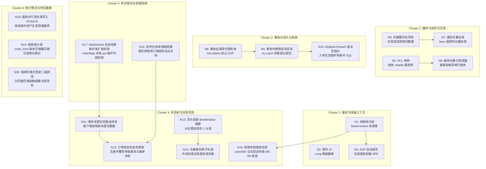

# SHISHAN009 · 暴风雨中的外卖系统：架构复盘与题解说明

本题目取材自真实微服务外卖项目（苍穹外卖），将其重构为零外部中间件依赖的单体应用，并植入了一张包含 20 个节点、4 条闭环级联路径的 **Bug Graph（故障拓扑图）**。
本题设计为 **Legendary Grandmaster（Rank 10 / 彩虹难度）**，核心特征是：每个 bug 表面均符合典型业务代码写法，单接口压测和常规单元测试全部正常，但在高并发混合场景与级联链路下将诱发连环雪崩。

---

## 一、Bug Graph 故障拓扑与多米诺骨牌效应

系统包含 6 大业务集群，20 个缺陷节点相互咬合：

### 四大闭环多米诺级联链路

1. **Loop A（点单-支付-推单-接单）**：
   `N1 (BaseContext 未清理)` 导致后台异步线程或复用线程拿到脏 ID；`N13 (金额浮点截断)` 与 `N14 (优惠券并发扣减)` 导致结算金额失真；提交订单后 `N11 (commit 前推单)` 使商家提前拉取未提交订单；商家确认与用户取消并发触发 `N12 (状态机无条件覆写)`，最终订单落入永久非法状态。
2. **Loop B（菜品维护-前台缓存-购物车）**：
   管理员修改菜品，`N4 (先删缓存)` 触发并发读请求回填旧数据，`N7 (全量清 keys)` 导致 Redis 瞬间被击穿；前台并发获取单例菜品缓存触发 `N5 (缺少 volatile 的 DCL)`，读取到半初始化对象；查询套餐关联菜品 `N6 (引用泄露)` 导致外部逻辑修改了内部缓存数据；用户并发加购/减购触发 `N15 (AB-BA 锁顺序反转)`，导致整个购物车请求卡死。
3. **Loop C（菜品批量删除与级联清理）**：
   管理员批量删除菜品，`N8 (this.delete 绕过事务代理)` 导致整个批量操作失去外部事务保护；删除口味由于网络或并发报错时，`N9 (try-catch)` 吞没了异常；删除口味在传入空列表时 `N10 (foreach 无保护)` 触发 MyBatis 语法错误，使得菜品本体被删除，口味与套餐关联数据成为无法清理的孤儿垃圾。
4. **Loop D（报表导出与后台运维）**：
   财务拉取运营报表，`N18 (parallelStream 并发 add 到普通 ArrayList)` 导致数据偶发为空或报 NPE；日度趋势报表 `N19 (只查有单日期且用 order_time)` 导致无销售日直接断档且跨日结算单被漏统；定时订单超时任务 `N16 (单线程 Task)` 被阻塞，进一步加剧了 `N12` 状态卡死。

---

## 二、20 个缺陷节点的根因与修复方案

### Cluster 1: 鉴权与线程上下文泄漏
- **N1: `BaseContext` 内存泄露与脏线程串号**
  - **根因**：`JwtTokenAdminInterceptor` 与 `JwtTokenUserInterceptor` 拦截器在 `preHandle` 将解析出的用户 ID 写入 `ThreadLocal`，但没有重写 `afterCompletion` 执行 `BaseContext.removeCurrentId()`。在 Tomcat 线程池复用机制下，后续未携带 Token 的异步请求或系统内部请求将继承上一个用户的权限。
  - **修复**：在两个拦截器中实现 `afterCompletion`，确保在请求处理完毕后无条件调用 `BaseContext.removeCurrentId()`。
- **N2: 雪花 ID Long 类型前端精度截断**
  - **根因**：订单与菜品 ID 采用 64 位雪花算法，超过 JavaScript `Number.MAX_SAFE_INTEGER` ($2^{53}-1 = 9007199254740991$)，在序列化为 JSON 时如果保留数值类型，前端收到的 ID 低几位会全部被舍入为 0，导致后续通过 ID 变更操作找不到记录。
  - **修复**：在 `JacksonObjectMapper` 中为 `Long.class` 和 `BigInteger.class` 注册 `ToStringSerializer.instance`，并在 `WebMvcConfiguration.extendMessageConverters` 中置于最高优先级。
- **N3: `AutoFillAspect` 包装类型拆箱 NPE**
  - **根因**：切面中获取当前操作人 ID 使用了基础类型 `long currentId = BaseContext.getCurrentId();`，当上下文未设置时返回 `null`，触发自动拆箱抛出 `NullPointerException`。
  - **修复**：使用引用类型 `Long currentId = BaseContext.getCurrentId()`，并在设置前做非空判断与保底默认值处理。

### Cluster 2: 缓存与双写可见性缺陷
- **N4: `DishController` 先删缓存后更新数据库**
  - **根因**：在更新菜品时，先执行了 `cleanCache("dish_*")`，再执行数据库更新。在并发读写下，更新尚未入库完成，读请求未命中缓存，从数据库加载旧值重新回填入缓存，导致缓存永久变脏。
  - **修复**：严格执行 Cache-Aside 标准流程：先执行 `dishService.updateWithFlavor(dishDTO)` 保证落库成功，然后再调用 `cleanCache(...)` 清除相关缓存。
- **N5: `DishCacheHolder` DCL 缺少 `volatile`**
  - **根因**：双重检查锁定（Double-Checked Locking）单例中，缓存容器字段未声明 `volatile`，指令重排序可能导致其他线程读取到分配了内存但未完全初始化的半对象。
  - **修复**：在单例成员变量前增加 `private static volatile DishCacheHolder instance;`。
- **N6: `SetmealServiceImpl` 缓存可变引用逃逸**
  - **根因**：`getDishItemById` 命中缓存后，直接将从缓存中取出的 `List<DishItemVO>` 返回给调用层。调用层或后续业务修改列表中的对象属性（如修改临时展示数量或价格）会直接污染全局共享缓存。
  - **修复**：返回前进行防御性拷贝（Defensive Copying），深拷贝每个 `DishItemVO` 对象后再返回。
- **N7: `DishController` 缓存失效通配符性能雪崩**
  - **根因**：单个菜品变更时粗暴执行 `redisTemplate.keys("dish_*")` 并全量删除，导致高并发下全部分类缓存瞬间失效，穿透到底层数据库。
  - **修复**：只清除受影响分类的缓存键 `dish_${categoryId}`。

### Cluster 3: 事务与持久化陷阱
- **N8: 事务自调用代理失效**
  - **根因**：`DishServiceImpl.deleteBatch` 遍历 ID 时，直接使用 `this.deleteDishWithFlavors(id)`。由于直接通过 `this` 调用绕过了 Spring AOP 动态代理，被调方法的 `@Transactional` 注解完全失效。
  - **修复**：在外部入口方法 `deleteBatch` 上添加 `@Transactional(rollbackFor = Exception.class)`，确保整个批量删除在同一个事务中执行。
- **N9: 事务内部静默吞没异常**
  - **根因**：`DishServiceImpl` 在删除关联口味时使用了 `try { dishFlavorMapper.deleteByDishId(id); } catch(Exception e) { log.error(...); }`。吞没异常后 Spring 事务管理器无法捕获异常，不会触发回滚，导致菜品被删除了但口味数据残留。
  - **修复**：移除吞没异常的 `try-catch` 块，让 SQL 异常正常向上抛出触发事务回滚。
- **N10: MyBatis foreach 语法空指针与坏 SQL**
  - **根因**：`DishFlavorMapper.xml` 中的 `deleteByDishIds` 直接写了 `<foreach collection="dishIds" item="dishId" open="(" separator="," close=")">#{dishId}</foreach>`。当传入空集合或 null 时，生成非法 SQL `delete from dish_flavor where dish_id in ()` 导致执行报错。
  - **修复**：添加 `<if test="dishIds != null and dishIds.size() > 0">` 判断包裹整个 `where in` 语句。

### Cluster 4: 状态机与并发竞态
- **N11: 事务提交前推送 WebSocket 消息**
  - **根因**：`OrderServiceImpl.submitOrder` 在数据库事务尚未提交前就调用了 `webSocketServer.sendToAllClient(json)`。商家收到提醒立即发起订单详情查询，由于数据库读已提交（Read Committed）隔离级别，此时查询不到刚提交的订单，返回 404。
  - **修复**：使用 `TransactionSynchronizationManager.registerSynchronization`，在 `afterCommit()` 回调中才执行 WebSocket 消息推送。
- **N12: 订单状态机无条件更新导致丢失更新**
  - **根因**：取消订单与接单流转直接执行 `update orders set status = ? where id = ?`，没有比对当前期望的前置状态。高并发下商家接单（状态 3）和用户取消（状态 6）发生竞态，后执行的 update 直接覆盖先执行的状态。
  - **修复**：引入 CAS 乐观锁状态判断：`update orders set status = ? where id = ? and status = ?`，若影响行数为 0 则抛出状态冲突业务异常。
- **N13: 订单金额 IEEE 754 截断丢失 1 分钱**
  - **根因**：订单金额汇总计算时使用了 `amount.doubleValue()` 进行加减乘除，二进制浮点数无法精确表示十进制小数，截断后产生 $0.009999999999$ 的舍入误差，最终入库金额少了 1 分钱。
  - **修复**：全链路采用 `BigDecimal`，加减乘除使用 `add`、`subtract`、`multiply` 并显式指定舍入模式 `RoundingMode.HALF_UP`。
- **N14: 优惠券非原子扣减超卖**
  - **根因**：先在代码中判断 `coupon.getCount() > 0`，再执行 `couponMapper.update(coupon)`。高并发下多线程同时读取到剩余 1 张，全部判断通过并扣减，导致库存扣成负数。
  - **修复**：使用带库存约束的原子 SQL：`update coupon set count = count - 1 where id = #{id} and count > 0`，根据返回的影响行数判断是否扣减成功。
- **N15: 购物车加减操作加锁顺序反转死锁**
  - **根因**：`ShoppingCartServiceImpl.add` 按照 `synchronized(userId)` -> `synchronized(dishId)` 的顺序加锁；而 `sub` 按照 `synchronized(dishId)` -> `synchronized(userId)` 的顺序加锁。在高并发同时加购与减购时，线程 A 占有 user 请求 dish，线程 B 占有 dish 请求 user，造成典型的 AB-BA 死锁。
  - **修复**：统一加锁层级，全局仅按照 `userId` 加锁，或者对多个资源按固定全局顺序加锁。

### Cluster 5: 异步驱动与调度陷阱
- **N16: 定时任务单线程阻塞**
  - **根因**：Spring 默认 `@Scheduled` 仅使用单线程任务调度器。当某个慢任务（例如批量统计检查）耗时较长时，后续所有定时任务（如 15 分钟未支付订单自动取消、派送中订单自动完成）被无限期积压推迟。
  - **修复**：配置 `ThreadPoolTaskScheduler`，设置核心线程数为 4 或以上，实现任务并发隔离执行。
- **N17: WebSocket 会话哈希表并发操作安全**
  - **根因**：`WebSocketServer` 中的 `sessionMap` 使用了普通的 `HashMap<String, Session>`。多个客户端并发连接建立与断开时，并发 `put`/`remove` 会损坏内部桶链表结构。
  - **修复**：使用 `ConcurrentHashMap<String, Session>`。

### Cluster 6: 统计聚合与时区截断
- **N18: 报表多线程写入非线程安全列表**
  - **根因**：报表数据导出时，采用 `parallelStream().forEach(exportList::add)`，`ArrayList` 不是线程安全的，多线程并发 `add` 导致数组下标竞争，出现元素覆盖、数组空洞（值为 null）或 `ArrayIndexOutOfBoundsException`。
  - **修复**：使用 `Collections.synchronizedList(new ArrayList<>())` 或直接使用单线程流 / `collect(Collectors.toList())`。
- **N19: 报表按创建时间统计且丢失无销量日期**
  - **根因**：营业额报表直接使用 `group by date(order_time)`，仅统计了有订单的日期。如果某天暴雨闭店没有订单，该日期在图表 X 轴上直接缺失，折线图时间轴产生跳变断档；且跨日订单（前一天 23:59 下单、次日 00:05 支付）统计口径与财务结算不一致。
  - **修复**：在 Java 端生成从 `begin` 到 `end` 的连续自然日序列，以结算时间 `checkout_time` 为准，使用 `Map` 补齐无销售日（补 0），保证返回数据点连续。
- **N20: 报表翻页缺少稳定二级排序**
  - **根因**：分页查询 SQL 仅写了 `order by order_time desc`。当同一秒内有大量并发订单生成时，由于时间戳完全一致，数据库在每次执行分页时不保证同值行的物理返回顺序，导致翻页时上一页看过的订单在下一页重复出现，或部分订单被漏掉。
  - **修复**：在 SQL 中增加主键二级确定性排序：`order by order_time desc, id desc`。

---

## 三、测试用例设计与覆盖

测试规格 `tests.yaml` 覆盖全部 20 个缺陷点：
1. **基础健康检查与鉴权**：探活、管理员登录、用户静默登录、未授权拦截。
2. **雪花 ID 字符串序列化验证**：检验 JSON 中大于 $2^{53}-1$ 的 ID 是否为原生 String。
3. **缓存一致性与双写读写时序**：更新菜品后并发读取用户端列表，验证不会回填旧数据。
4. **套餐关联查询与深拷贝**：验证修改返回的套餐规格对象不会影响后续请求的查询结果。
5. **批量删除事务原子性与 MyBatis 语法安全**：构造抛出异常的批量删除，验证全量回滚；验证空列表删除不报错。
6. **购物车并发操作与无死锁验证**：多线程交叉并发调用加购与减购，检验无阻塞、计数准确。
7. **订单计算与优惠券并发核销**：
   - 验证高精度金额计算无 1 分钱截断误差；
   - 验证 1 张剩余优惠券在多并发下单下仅成功 1 单，绝不超卖。
8. **状态机 CAS 幂等验证**：并发取消与接单，验证不会发生非法状态覆盖。
9. **报表统计连续性与多线程安全**：
   - 验证无销售日 0 值补齐；
   - 验证多线程导出报表列表无 null 元素和缺失。
